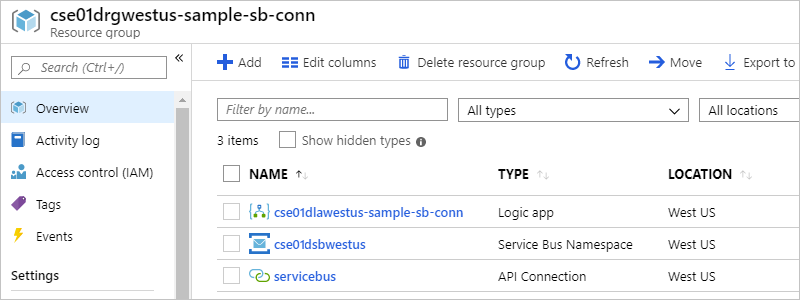

# Why scale?

The samples provided in this repository have an element of scaling that needs some explanation. Microsoft Logic Apps have scaling built into them, so why do we need to have more than one instance of the them defined for a single environment?

Some of the non native API Connections have throttling built into them. That throttling can prevent the logic app from getting high scale performance bench marks that the logic app would otherwise be able to handle. 

This can be solved by creating more than one instance of the API Connection and by virtue of that, more than one instance of the API connection.

Now we could easily have those instances all contained within a single resource group, but what you would see is a large amount of API connections and logic apps all sitting in that same resource group. Scaling down would require cherry picking the resources that are grouped together.

Troubleshooting would require knowledge of which API connection is for which logic app. If you have logic apps that depend on more than one API connection or even more complicated to troubleshoot, more than one API Connection of the same type. 

Using a different resource group for each logic app instance provides greater clarity of which API connections are for which logic app. Scaling up and down becomes a much easier task to accomplish as well.

> While the samples provide the ability to scale, not scaling is a very acceptable use case. Just provide an instanceCount of 1 and you will get a single instance of the logic app.

## What does this look like?

So lets imagine you have a fairly simple implementation of reading from one service bus queue, doing some magic within the logic app, than posting a message to another service bus queue. From a resources perspective your resource group would look like this.

Currently the Service Bus API Connection has throttling built into. So this means if you use a single API connection for both reading and sending AND you have a high throughput requirement on this logic app, that Service Bus API Connection could very well become your bottle neck. 

So first you try to separate the API Connections to use one for the read and a different one for the sending. Your resource now look like this.

Only, you're still hitting the throttling off of those API Connections and you're no where near your throughput requirements. So you decide to create more than one instance of the logic app and it's API Connections. The first one does not look half bad. 

Now let's imagine you need to implement another logic app to read from that second service bus queue and do some magic that populates a cosmos db. You don't want to share the API connections from the first logic app otherwise you'll be stepping on that logic apps throughput. So you're resources now look like this.

Here is where things get really hairy. You find out you're still not hitting the throughput requirements on that first logic app and need to create another instance. That ends up looking like this.

Next you see the same throttling occurring on the second logic app. So you need to create another instance of the second logic app and it's connections. 

At what point did you loose track of which service bus API connection belonged to which logic app?

What happens when you need to scale even more of both?

What happens when you need to remove an instance from either? or both? Which API connections belong to which logic app?

Now you need to replicate in the testing environment, staging environment and production environment, and provide instructions to the operations team to be able to support this beast...

This is why the samples in this repository provide the ability to scale up by using an instance count parameter and why that scaling up is done with a logic app and it's dependent API connections in their own resource group. This creates a much easier to manage and troubleshoot environment.

This separation of resources gives you different resource groups for each instance of the logic app and it's dependency API connections like this.

Each one of those instanced logic apps has the same resources configured and looks like this.

This makes it very clear which API connections are used by that logic app.

Since our shared resources (the service bus and cosmos db) don't need to scale with the logic apps, we keep them separate in a "shared" resource resource group.